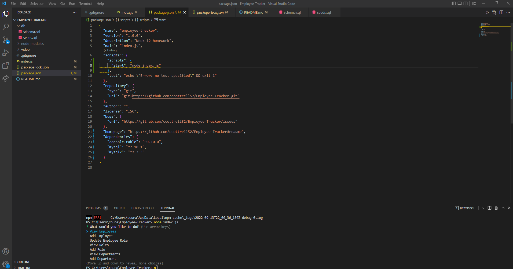

# Employee-Tracker
Week 12 homework 

Using Mysql i created a database in which an employer can view his employees and add new employees to his system. He can also dictate salary and roles. 
I ran into a few challenges while creating this project including creating the index file to run the application. I'm hoping that by creating this it 
would create an easy way for an employer to keep track of his employees. My goal was to make it easy to use as well as creating prompts to walk you through the creation
of your employee database.

